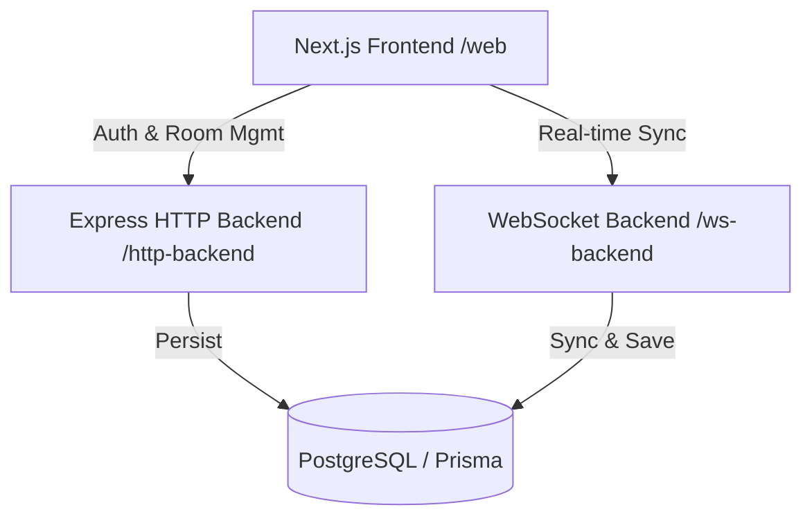
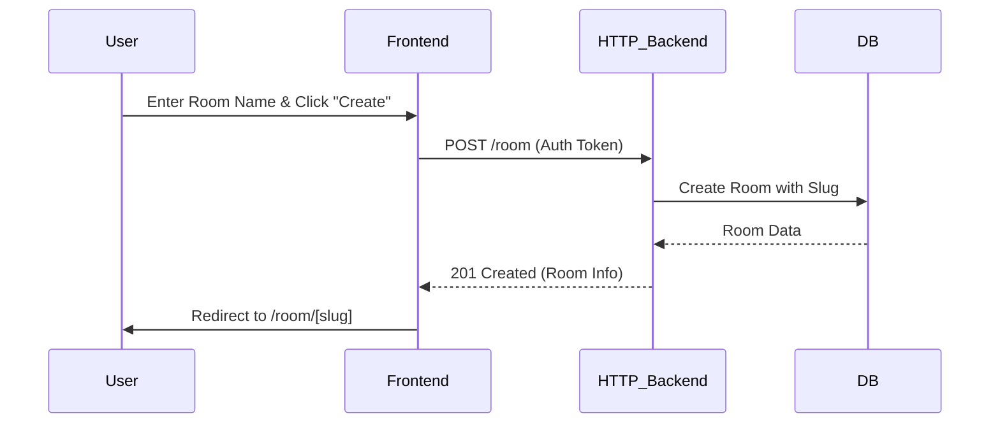
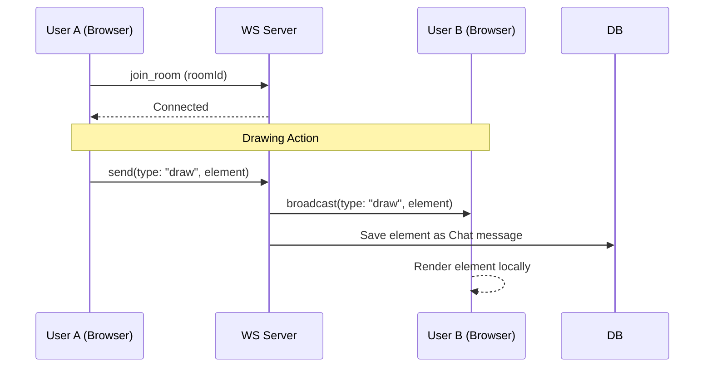

# Draw.us — Neubrutalist Collaborative Canvas

Draw.us is a high-performance, real-time collaborative drawing application built with a premium **Neubrutalist** design aesthetic. It allows users to create rooms, draw shapes, and edit text simultaneously with others in a seamless, infinite canvas experience.

## ✨ Features

- **Collaborative Infinite Canvas**: Pan and zoom across a limitless drawing space.
- **Real-time Sync**: Drawing actions are broadcasted instantly via WebSockets.
- **Neubrutalist UI**: Bold typography, high-contrast borders, and signature "hard" shadows.
- **Smart Text Tool**: Dynamic auto-resizing text boxes and live font-scaling during typing.
- **Interactive Resizing**: Professional-grade resize handles for shapes and text.
- **Authentication**: Secure sign-up/sign-in flows with neubrutalist visual feedback.

---

## 🏗️ Architecture Overiew

This project is a **Turborepo monorepo** consisting of three main services and shared packages.



### 📦 Apps and Packages
- `apps/web`: Next.js frontend with Canvas2D rendering and TailwindCSS.
- `apps/http-backend`: Express.js REST API for user authentication and room management.
- `apps/ws-backend`: Fastify/Node-ws server for low-latency element broadcasting.
- `packages/db`: Shared Prisma client and database schema.
- `packages/common`: Shared Zod schemas and TypeScript types.

---

## 🚀 Key Application Flows

### 1. Room Creation & Navigation
When a user wants to start a new collaborative session:



### 2. Real-time Collaboration (WebSocket)
Once inside a room, the application synchronizes every stroke and edit:



---

## 🎨 Design Philosophy: Neubrutalism

Draw.us follows the **Neubrutalist** design trend, characterized by:
- **Thick Outlines**: All interactive elements use `3px` solid black borders.
- **Hard Shadows**: Instead of soft blurs, we use offset solid blocks (e.g., `8px 8px 0 0 #000`).
- **Vibrant & Muted Colors**: Combining "Electric Indigo" (`#5b5bd6`) and "Hot Pink" (`#ff3b8f`) with off-white backgrounds.
- **Dynamic Interaction**: Components "press down" on click, translating `(4px, 4px)` and shrinking shadows to simulate physical depth.

---

## 🛠️ Getting Started

### Prerequisites
- Node.js (v18+)
- pnpm (recommended)
- Docker (for PostgreSQL/Prisma)

### Local Development

1. **Clone the repo**
2. **Install dependencies**:
   ```bash
   pnpm install
   ```
3. **Setup Database**:
   ```bash
   cd packages/db
   npx prisma generate
   # Ensure your .env is set for DATABASE_URL
   ```
4. **Run all services**:
   ```bash
   turbo dev
   ```

The frontend will be available at `http://localhost:3000`.
